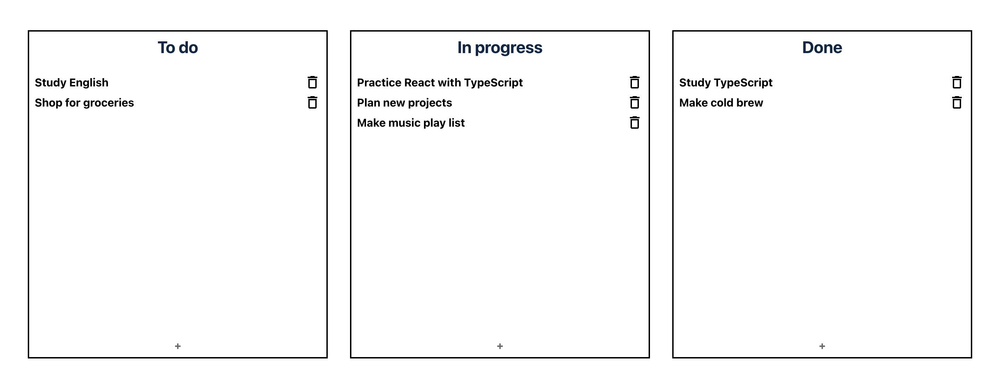

# Todo List with TSX

Read this in other languages: [한국어 🇰🇷](README.ko.md)

You can try this app, click below badge!
</br>

<a href="https://hardcore-wiles-79bcb5.netlify.app" target="_blank"></a>



## 🚀 開発背景

- TypeScript & React の練習で，Drag&Drop でリストの順序を変えれる簡単な Todo List App を作ろう！
- styled-component を使ってみる

## 🦄 使用言語とツール

<p>
    &nbsp;&nbsp;
    &nbsp;&nbsp;
    &nbsp;&nbsp;
    &nbsp;&nbsp;
    
    &nbsp;&nbsp;
    &nbsp;&nbsp;
 </p>

## 📚 使用ライブラリとリソース

- [react-beautiful-dnd](https://github.com/atlassian/react-beautiful-dnd): Drag&Drop でリストの順序変更

- [@material-ui/icons](https://material-ui.com/getting-started/installation/s): icon

This project was bootstrapped with [Create React App](https://github.com/facebook/create-react-app).

## 📖 Project で新しく勉強した事

### Controlled Components と Unontrolled Components

- React で form を実装する方法は 2 つ: Controlled Component, Uncontrolled Component
- [Controlled Components](https://reactjs.org/docs/forms.html#gatsby-focus-wrapper)は，入力と同時に値が更新
  - React により state をコントロール(onChange)
- [Uncontrolled Components](https://reactjs.org/docs/uncontrolled-components.html)は，必要な際に入力値を持ってくるように直接指定
  - 既存の HTML forms で ref を利用したように Uncotrolled Components でも ref で DOM 要素に接近
  - Class componet では createRef(), Hooks では useRef()
- 状況に応じて適切な方を選択
  - このプロジェクトで新しいタスクを追加する際には，入力と同時に値を更新するとむしろ必要のない re-rendering
- [&#32;一緒に読むといい資料](https://goshakkk.name/controlled-vs-uncontrolled-inputs-react/)

### Record

- TypeScript の[Utility types](https://www.typescriptlang.org/docs/handbook/utility-types.html)の一つ
- object type を作る際に利用
- 次のように Tasks という object の type を定義し，

  ```typescript
  type TaskId = string;
  type Task = {
    id: TaskId;
    name: string;
  };
  type Tasks = {
    [id: TaskId]: Task;
  };
  ```

  App コンポーネントの remove method で次のように使うとエラーが発生

  ```typescript
  const newTasks: Tasks = { ...prevTasksData.tasks };
  delete newTasks[task.id];
  ```

  task&#46;id の値を指定する際に，TaskId 型にしても結局は string 型なので，newTasks は "なぜ key として TaskId ではなく string をくれてるの？"ってなる．

  そこで，utility type の Record を利用

  ```typescript
  type Tasks = Record<TaskId, Task>;
  ```

  Record の API を見ると，string 型を extend した type を key とする object を宣言

  ```typescript
  type Record<K extends keyof any, T> = {
    [P in K]: T;
  };
  ```

  つまり，task&#46;id が string として入っても通るようになる．
